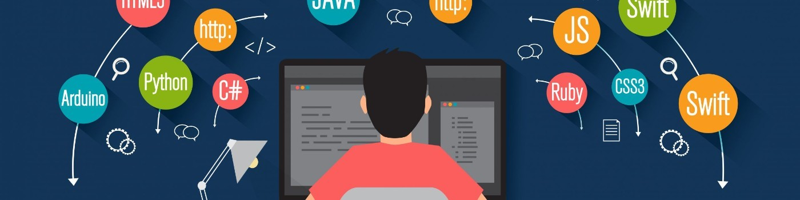

# Bienvenidos a mi GitHub! 👋🻠Yo soy Johan Arteaga! 

Yo soy Johan Arteaga 🙋🏻‍♂️, Soy Full Stack Developer
He trabajado en tecnologias tales como:

- React.js
- Node.js 
- Express 
- Sql 
- Postgres 
- Sequelize

Entre otras tecnologias

## Contactame 🤝🏻
- LinkedIn: https://www.linkedin.com/in/johan-arteaga
- Whatsapp: https://wa.me/573107464006 (+57 3107464006)

<!--
**Jaac219/Jaac219** is a ✨ _special_ ✨ repository because its `README.md` (this file) appears on your GitHub profile.

Here are some ideas to get you started:

- 🔭 I’m currently working on ...
- 🌱 I’m currently learning ...
- 👯 I’m looking to collaborate on ...
- 🤔 I’m looking for help with ...
- 💬 Ask me about ...
- 📫 How to reach me: ...
- 😄 Pronouns: ...
- ⚡ Fun fact: ...
-->
